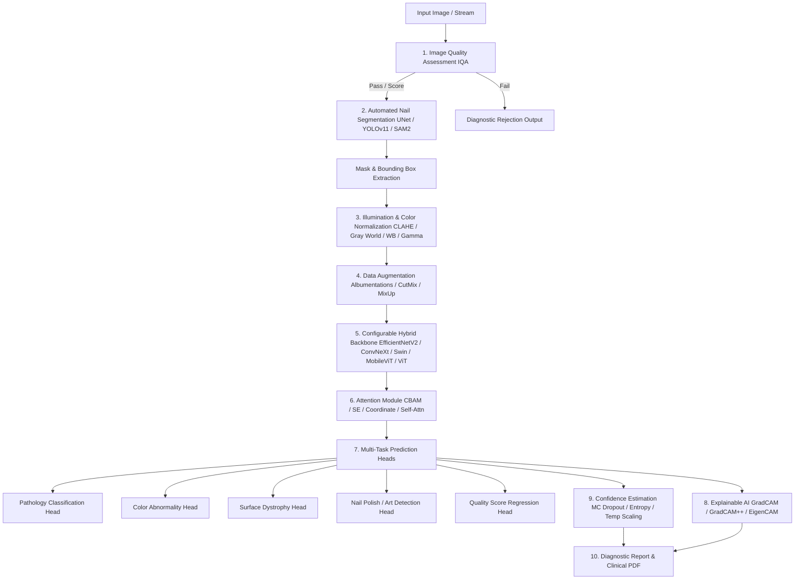

# AI Nailysis V2: Clinical Multi-Task Vision Architecture (IEEE WACV Standard)

[](https://wacv.thecvf.com/)
[](https://www.python.org/)
[](https://pytorch.org/)
[](https://tensorflow.org/)
[](https://fastapi.tiangolo.com/)
[](LICENSE)

**AI Nailysis V2** is a modular, research-grade Computer Vision system designed for pathological nail screening, real-time hand posture tracking, automated segmentation, illumination & color normalization, multi-task deep learning, epistemic confidence quantification, and explainable AI heatmap generation.

---

## 🏛️ System Architecture



---

## 🛠️ Step-by-Step Setup & Installation Guide

### Prerequisites
- **Python**: Version `3.10` or higher
- **Git**: Installed and available in PATH
- **Hardware**: CUDA-compatible GPU recommended for training/inference (CPU mode fully supported)

---

### 1. Clone the Repository
```bash
git clone https://github.com/Rajkothari200/AI-Nailysis.git
cd AI-Nailysis
```

---

### 2. Create and Activate Virtual Environment

#### Windows (PowerShell / Command Prompt)
```powershell
# Create environment
python -m venv nailenv

# Activate environment (PowerShell)
.\nailenv\Scripts\Activate.ps1

# Activate environment (CMD)
.\nailenv\Scripts\activate.bat
```

#### Linux / macOS
```bash
# Create environment
python3 -m venv nailenv

# Activate environment
source nailenv/bin/activate
```

---

### 3. Install Dependencies
```bash
pip install --upgrade pip
pip install -r requirements.txt
```

---

### 4. Dataset & Model Weights Setup

> [!NOTE]
> For repository cleanliness and standard research hygiene, raw image datasets, sample test images, and binary model weights (`.h5`, `.keras`, `.pt`) are excluded from Git tracking via `.gitignore`.

To train models or run offline inference, structure your local directories as follows:

```
AI-Nailysis/
├── Stage1/                       # Stage 1: Binary Pathology (Healthy vs Anomalous)
│   ├── train/
│   │   ├── disease/
│   │   └── healthy/
│   ├── val/
│   └── test/
├── Stage2/                       # Stage 2: 6-Class Pathology Classification
│   ├── train/
│   │   ├── clubbing/
│   │   ├── cyanosis/
│   │   ├── melanoma/
│   │   ├── onychogryphosis/
│   │   ├── onychomycosis/
│   │   └── psoriasis/
│   ├── val/
│   └── test/
├── Stage_Polish/                 # Stage 3: Cosmetic Polish / Nail Art Detection
│   ├── train/
│   │   ├── natural/
│   │   └── polish/
│   ├── val/
│   └── test/
└── weights/                      # Trained Weight Binaries Directory
```

---

### 5. Start Application Server

Launch the web diagnostic dashboard and FastAPI application backend:

```bash
# Direct python launcher
python app.py

# Or via Uvicorn server directly
uvicorn app.main:app --host 0.0.0.0 --port 8000 --reload
```

* **Web Interface**: Open `http://localhost:8000` in your web browser.

---

### 6. REST API Endpoint Reference

| Method | Endpoint | Description |
| :--- | :--- | :--- |
| `GET` | `/` | Serves interactive web diagnostic interface |
| `POST` | `/analyze` | Single image analysis (Pathology, Polish Detection, IQA & Confidence) |
| `POST` | `/analyze_batch` | Batch multi-image diagnostic analysis |
| `GET` | `/db` | Retrieves clinical database and disease medical profiles |
| `POST` | `/chat` | AI Diagnostic assistant query endpoint |
| `POST` | `/log` | System logger and pipeline event viewer |

---

### 7. Evaluation & Model Export

#### Export Model to ONNX & TensorRT
```python
from models.multi_task import MultiTaskAINailysisModel
from inference.export import ModelExporter
import yaml

with open("configs/config.yaml") as f:
    config = yaml.safe_load(f)

model = MultiTaskAINailysisModel(config)
exporter = ModelExporter(model, config)
exporter.export_onnx("weights/ai_nailysis_v2.onnx")
exporter.generate_tensorrt_script("weights/ai_nailysis_v2.onnx")
```

#### Run Model Evaluation & Explainability Scripts
```bash
# Evaluate Stage 1 Model Performance
python evaluate_stage1_full.py

# Run Occlusion Heatmap & Explainable AI Engine
python occlusion_explain.py
```

---

## 📦 Directory Structure

```
.
├── configs/
│   └── config.yaml               # Master YAML Configuration (Zero hardcoded parameters)
├── utils/
│   ├── iqa.py                    # Module 1: Image Quality Assessment Engine
│   ├── color_norm.py             # Module 3: Illumination & Color Normalization Engine
│   ├── xai.py                    # Module 8: Explainable AI Engine (GradCAM, GradCAM++, EigenCAM)
│   ├── confidence.py             # Module 9: MC Dropout & Uncertainty Quantification
│   └── logger.py                 # Module 14: PEP8 Logging Engine
├── models/
│   ├── backbones.py              # Module 5: Hybrid Backbone Factory (ConvNeXt, Swin, ViT, etc.)
│   ├── attention.py              # Module 6: PyTorch Attention Modules (CBAM, SE, Coord, Self-Attn)
│   ├── multi_task.py              # Module 7: Multi-Task Shared Backbone Network
│   └── segmentation.py           # Module 2: Automated PyTorch U-Net & YOLO/SAM2 Adapters
├── datasets/
│   ├── loader.py                 # Custom PyTorch Datasets & DataLoaders
│   └── augmentations.py          # Module 4: Albumentations & CutMix / MixUp Pipelines
├── training/
│   ├── trainer.py                # Multi-Task PyTorch Trainer with AMP
│   ├── losses.py                 # Multi-Task Combined Loss Functions
│   └── metrics.py                # Batch Evaluation Metrics
├── evaluation/
│   ├── evaluator.py              # Module 10: Full Metric Evaluation Suite
│   └── plots.py                  # High-Resolution Visualization Engines
├── inference/
│   ├── pipeline.py               # Research-Grade V2 Inference Pipeline
│   ├── export.py                 # Module 15: ONNX & TensorRT Model Exporter
│   └── legacy_adapter.py         # Backward Compatibility Bridge
├── experiments/
│   └── logger.py                 # Module 11: Automated Experiment Tracker
├── app/
│   ├── main.py                   # Modular FastAPI Web Server
│   └── api/
│       └── routes.py             # FastAPI Endpoints (/analyze, /analyze_batch, /db, /chat, /log)
├── app.py                        # Entrypoint preserving 100% backward compatibility
└── requirements.txt              # Production Dependency Specifications
```

---

## 📜 Citation

If you find **AI Nailysis V2** useful in your computer vision or clinical healthcare research, please consider citing:

```bibtex
@inproceedings{ainailysis2027wacv,
  title={AI Nailysis V2: Real-Time Multi-Task Pathological Nail Diagnosis with Visual Quality Assessment and Explainable Attention},
  author={Raj Kothari},
  booktitle={IEEE/CVF Winter Conference on Applications of Computer Vision (WACV)},
  year={2027}
}
```

---

## 📄 License
Distributed under the **MIT License**. See `LICENSE` for more information.
