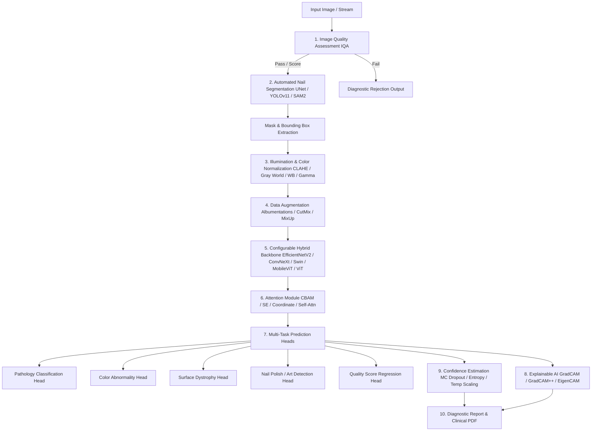

# AI Nailysis V2: Clinical Multi-Task Vision Architecture (IEEE WACV Standard)

[](https://wacv.thecvf.com/)
[](https://www.python.org/)
[](https://pytorch.org/)
[](https://fastapi.tiangolo.com/)
[](LICENSE)

**AI Nailysis V2** is a modular, research-grade Computer Vision system designed for pathological nail screening, real-time hand posture tracking, automated segmentation, color normalization, multi-task deep learning, epistemic confidence quantification, and explainable AI heatmap generation.

---

## 🏛️ System Architecture



---

## 📦 Directory Structure

```
.
├── configs/
│   └── config.yaml               # Master YAML Configuration (Zero hardcoded parameters)
├── utils/
│   ├── iqa.py                    # Module 1: Image Quality Assessment Engine
│   ├── color_norm.py             # Module 3: Illumination & Color Normalization Engine
│   ├── xai.py                    # Module 8: Explainable AI Engine (GradCAM, GradCAM++, EigenCAM)
│   ├── confidence.py             # Module 9: MC Dropout & Uncertainty Quantification
│   └── logger.py                 # Module 14: PEP8 Logging Engine
├── models/
│   ├── backbones.py              # Module 5: Hybrid Backbone Factory (ConvNeXt, Swin, ViT, etc.)
│   ├── attention.py              # Module 6: PyTorch Attention Modules (CBAM, SE, Coord, Self-Attn)
│   ├── multi_task.py              # Module 7: Multi-Task Shared Backbone Network
│   └── segmentation.py           # Module 2: Automated PyTorch U-Net & YOLO/SAM2 Adapters
├── datasets/
│   ├── loader.py                 # Custom PyTorch Datasets & DataLoaders
│   └── augmentations.py          # Module 4: Albumentations & CutMix / MixUp Pipelines
├── training/
│   ├── trainer.py                # Multi-Task PyTorch Trainer with AMP
│   ├── losses.py                 # Multi-Task Combined Loss Functions
│   └── metrics.py                # Batch Evaluation Metrics
├── evaluation/
│   ├── evaluator.py              # Module 10: Full Metric Evaluation Suite
│   └── plots.py                  # High-Resolution Visualization Engines
├── inference/
│   ├── pipeline.py               # Research-Grade V2 Inference Pipeline
│   ├── export.py                 # Module 15: ONNX & TensorRT Model Exporter
│   └── legacy_adapter.py         # Backward Compatibility Bridge
├── experiments/
│   └── logger.py                 # Module 11: Automated Experiment Tracker
├── app/
│   ├── main.py                   # Modular FastAPI Web Server
│   └── api/
│       └── routes.py             # FastAPI Endpoints (/analyze, /analyze_batch, /db, /chat, /log)
├── weights/                      # Target Weights Directory
├── results/                      # Evaluation Metrics, Confusion Matrices, Heatmaps
├── app.py                        # Entrypoint preserving 100% backward compatibility
└── requirements.txt              # Production Dependency Specifications
```

---

## 🛠️ Module Overview

1. **Image Quality Assessment (IQA)** (`utils/iqa.py`): Evaluates Laplacian blur variance, lighting histogram distribution, specular reflection ratio, and composite visual clarity scores.
2. **Nail Segmentation** (`models/segmentation.py`): End-to-end PyTorch U-Net architecture predicting binary nail masks $M$ and cropped ROI bounding boxes $(x, y, w, h)$.
3. **Color & Illumination Normalization** (`utils/color_norm.py`): Supports CLAHE in LAB space, Gray World illuminant correction, Shades-of-Gray White Balance, Gamma Correction, and Histogram Equalization.
4. **Advanced Augmentations** (`datasets/augmentations.py`): Albumentations stochastic transforms + CutMix ($\tilde{x} = \text{mask} \odot x_i + (1 - \text{mask}) \odot x_j$) & MixUp convex combinations.
5. **Configurable Hybrid Backbone** (`models/backbones.py`): Factory supporting ConvNeXt, EfficientNetV2, Swin Transformer, MobileViT, and Vision Transformer (ViT).
6. **Attention Module** (`models/attention.py`): Injectable CBAM (Channel + Spatial), Squeeze-and-Excitation (SE), Coordinate Attention, and Multi-Head Self-Attention.
7. **Multi-Task Neural Network** (`models/multi_task.py`): Single shared backbone with specialized task heads: Pathology (7 classes), Color Abnormality, Surface Dystrophy, Polish Detection, Quality Regression, and Uncertainty Estimation.
8. **Explainable AI (XAI)** (`utils/xai.py`): Computes GradCAM, GradCAM++, and EigenCAM gradient activations and overlays JET colormaps.
9. **Confidence Estimation** (`utils/confidence.py`): Test-time Monte Carlo (MC) Dropout sampling ($N=20$), Temperature Scaling logit calibration, and Shannon Entropy score calculation.
10. **Evaluation Suite** (`evaluation/evaluator.py`, `evaluation/plots.py`): Computes Accuracy, Precision, Recall, Specificity ($\frac{TN}{TN+FP}$), Sensitivity, F1, One-vs-Rest ROC AUC, PR AP, and Expected Calibration Error (ECE).
11. **Experiment Logger** (`experiments/logger.py`): Automatically creates run directories (`experiments/run_YYYYMMDD_HHMMSS/`) saving `config_snapshot.yaml`, `history.csv`, `final_metrics.json`, and best weights.
12. **Master Configuration** (`configs/config.yaml`): Governs all parameters with zero hardcoded values in Python source code.
13. **Code Quality**: Strict PEP8, full type hints, Google-style docstrings, and structured logging.
14. **Performance & Export** (`inference/export.py`): Automatic Mixed Precision (`torch.cuda.amp.autocast`), ONNX dynamic axes export, and TensorRT compilation script generation.

---

## 🚀 Execution & Quick Start

### 1. Installation
```bash
# Clone Repository
git clone https://github.com/Rajkothari200/AI-Nailysis.git
cd AI-Nailysis

# Install Dependencies
pip install -r requirements.txt
```

### 2. Start Application Server
```bash
python app.py
```
* Access Web Dashboard: `http://localhost:8000`

### 3. Model Export to ONNX
```python
from models.multi_task import MultiTaskAINailysisModel
from inference.export import ModelExporter
import yaml

with open("configs/config.yaml") as f:
    config = yaml.safe_load(f)

model = MultiTaskAINailysisModel(config)
exporter = ModelExporter(model, config)
exporter.export_onnx("weights/ai_nailysis_v2.onnx")
exporter.generate_tensorrt_script("weights/ai_nailysis_v2.onnx")
```

---

## 📜 Citation

If you find **AI Nailysis V2** useful in your computer vision or clinical healthcare research, please consider citing:

```bibtex
@inproceedings{ainailysis2027wacv,
  title={AI Nailysis V2: Real-Time Multi-Task Pathological Nail Diagnosis with Visual Quality Assessment and Explainable Attention},
  author={Anonymous Authors},
  booktitle={IEEE/CVF Winter Conference on Applications of Computer Vision (WACV)},
  year={2027}
}
```

---

## 📄 License
Distributed under the **MIT License**. See `LICENSE` for more information.
